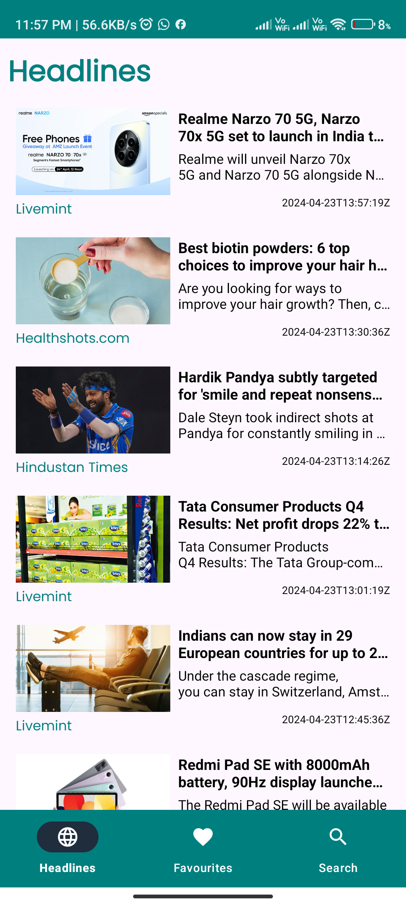
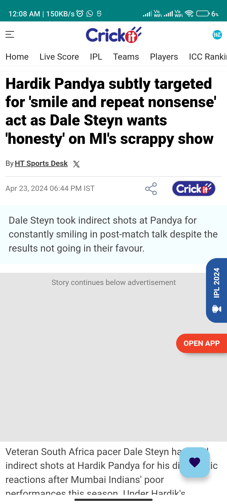
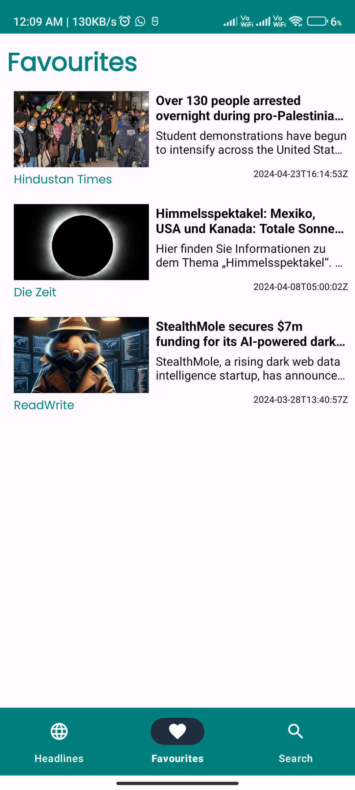
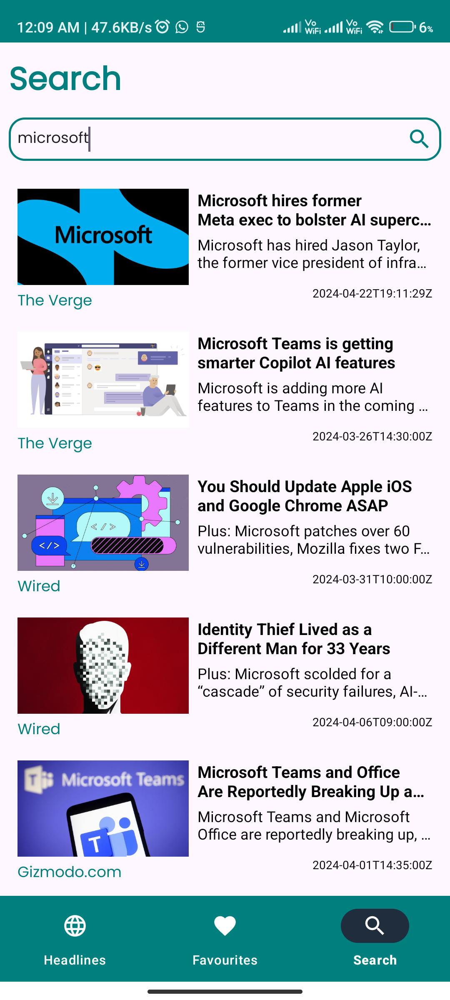

# TrendTrack

TrendTrack is an Android news app developed in Kotlin, designed to provide users with the latest news headlines, favorite news management, and search functionality. The app is built using the MVVM (Model-View-ViewModel) architecture pattern, leveraging Room Database for local data storage and Retrofit for API calls to retrieve news data from [News API](https://newsapi.org/).

| Headlines | Article Details | Favorites | Search News |
|:---------:|:-------------:|:--------------:|:--------------:|
|  |  |  |  |

## Features

- **Top Headlines:** View the latest news headlines from various sources and categories.
- **Favorite News:** Save your favorite news articles for easy access.
- **Search News:** Search for specific news topics or articles.
- **MVVM Architecture:** Organized codebase following the MVVM architecture pattern for clear separation of concerns and maintainability.
- **Room Database:** Utilizes Room Database for efficient local storage of favorite news articles.
- **Retrofit:** Integration of Retrofit for seamless API calls to fetch news data from the News API.

## Getting Started

To get started with TrendTrack, follow these steps:

1. Clone the repository to your local machine:

   ```bash
   git clone https://github.com/your_username/TrendTrack.git

2. Open the project in Android Studio.
   
3. Obtain an API key from News API by signing up for an account.
  
4. Open the Constants.kt file located in `app/src/main/java/com/sbmshukla/trendtrack/utils/` directory.

5. Replace the value of API_KEY with your News API key:

   ```bash
   const val API_KEY = "your_api_key_here"

6. Build and run the project on your Android device or emulator.
    ```bash
   Note: Make sure to replace "your_api_key_here" with your actual News API key. This will guide users on where to place their API key within the project. Let me know if you need further assistance!

## Usage

- **Top Headlines:** Upon launching the app, you will see the latest top headlines from various news sources and categories. Click on any headline to view the full article.
- **Favorite News:** To save a news article as a favorite, simply tap the "Favorite" button associated with the article. You can access your favorite articles from the Favorites section in the app.
- **Search News:** Use the search bar at the top of the screen to search for specific news topics or articles. TrendTrack will display relevant search results in real-time as you type.

## Dependencies

  TrendTrack relies on the following libraries and dependencies:
  
  ```kotlin
  val roomVersion = "2.6.1"
  val lifecycleVersion = "2.7.0"
  val coroutineVersion = "1.8.1-Beta"
  val navVersion = "2.7.7"
  val retrofitVersion = "2.9.0"
  val okHttpVersion = "4.12.0"
  val glideVersion = "4.16.0"
  val glideCompilerVersion = "4.16.0"
  
  // Room - A SQLite object mapping library for Android.
  implementation("androidx.room:room-runtime:$roomVersion")
  kapt("androidx.room:room-compiler:$roomVersion")
  implementation("androidx.room:room-ktx:$roomVersion")
  
  // ViewModel - A part of the Android Architecture Components used to manage UI-related data in a lifecycle-conscious way.
  implementation("androidx.lifecycle:lifecycle-viewmodel-ktx:$lifecycleVersion")
  implementation("androidx.lifecycle:lifecycle-viewmodel-compose:$lifecycleVersion")
  
  // LiveData - An observable data holder class used to notify views when the underlying data changes.
  implementation("androidx.lifecycle:lifecycle-livedata-ktx:$lifecycleVersion")
  
  // Coroutines - For managing asynchronous programming and background tasks.
  implementation("org.jetbrains.kotlinx:kotlinx-coroutines-core:$coroutineVersion")
  
  // Navigation - For managing navigation within the app.
  implementation("androidx.navigation:navigation-fragment-ktx:$navVersion")
  implementation("androidx.navigation:navigation-ui-ktx:$navVersion")
  
  // Retrofit - A type-safe HTTP client for Android and Java.
  implementation("com.squareup.retrofit2:retrofit:$retrofitVersion")
  implementation("com.squareup.retrofit2:converter-gson:$retrofitVersion")
  
  // OKHttp - Used as an HTTP client for Retrofit with logging interceptor.
  implementation("com.squareup.okhttp3:okhttp:$okHttpVersion")
  implementation("com.squareup.okhttp3:logging-interceptor:$okHttpVersion")
  
  // Glide - An image loading and caching library for Android.
  implementation("com.github.bumptech.glide:glide:$glideVersion")
  kapt("com.github.bumptech.glide:compiler:$glideCompilerVersion")
```
## Contributing

We welcome contributions from the community to help improve TrendTrack. If you encounter any bugs, have feature requests, or want to contribute code, please submit a pull request or open an issue on GitHub.

## Contact

For questions, feedback, or support related to TrendTrack, please contact us at sbmshukla17@gmail.com.
